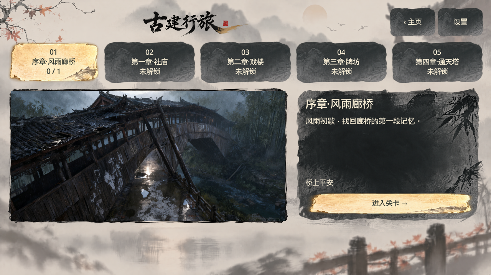
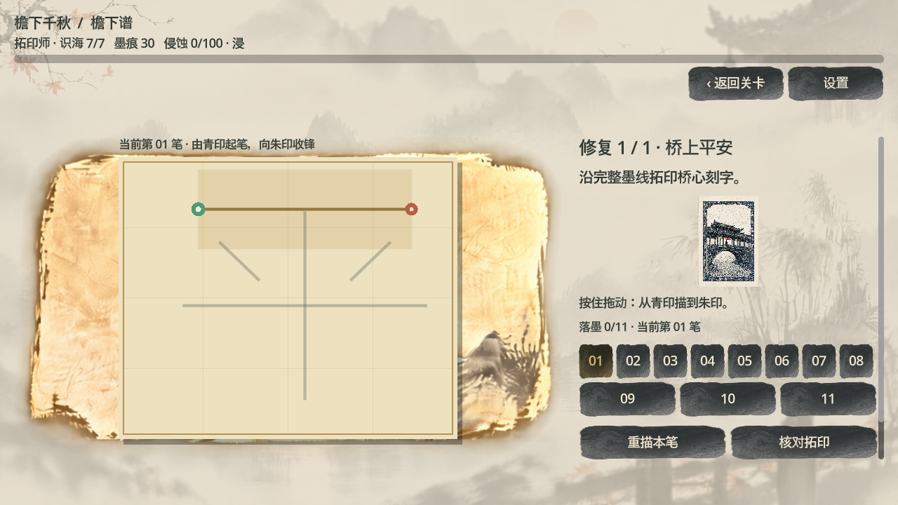

# 水墨 UI 与游玩流程简化

开发入口：`客户端/project.godot`。本次更新源码与 Markdown；历史 dist 安装包、Word/PDF 和参赛快照未重打包。

## 实现

- 参考 material/Example1、Example2，复用分层背景、墨刷、纸卡、边框与题字，建立统一水墨主题。素材路径及来源见 `客户端/assets/ink_ui/README.md`。无需新增生图，未使用或保存临时密钥。
- 三个核心页面：主页、关卡、游戏。取消心舍／账册／剧情常驻导航；主页“旅途收藏”下提供记忆图录、取舍记录和往事回放。
- 关卡保留五章预览、解锁检查和重访。默认只显示当前下一任务入口；未完成会话优先继续，避免误开其他事件。
- 调查只显示最新线索与进度；修复说明缩短，历史调查线索默认折叠、按需展开；满容量才显示替换记忆；结算改为左图右结果，并提供下一未完成任务入口。
- 游戏、描摹、构件、机关、对话、收藏、设置及结果页复用主题；关卡与纸面游戏背景统一为水墨山水，各古建场景原画保留用于调查、对话与战斗。
- 正式策划 Markdown 与开发策划 Markdown 已同步结构、文案、容量取舍与可选收藏规则。新 Mermaid 结构图取代旧五入口结构。

## 验证

使用独立端口 18091／18092、`.review/ink-ui` 存档和用户目录，不改真实存档。Godot 4.5.2 使用 ANGLE 渲染。

- `tests/review_journey.gd`：真实鼠标输入完成十任务，包括描摹、拖动构件、八场战斗、第三技艺首领、替换确认、184 段配音、数字键冷却和最终结算。
- `tests/front_pages_review.gd`：960×540、1280×720、1600×720 的主页／锁定章节按钮边界；调查返回继续、收藏入口、修复画布、结算按钮、下一任务与全通关回到地图。
- 实机截图复查后修正纹理缩放与结算布局。当前截图及日志在 `验证记录/2026-09-28-水墨UI/`。
- 环境存在系统根证书读取提示与旧描摹细线抗锯齿警告；本地 HTTP 服务与测试流程可正常完成。初次默认用户目录日志不可写导致启动失败，验证已改用工作区独立用户目录。

## 预览

