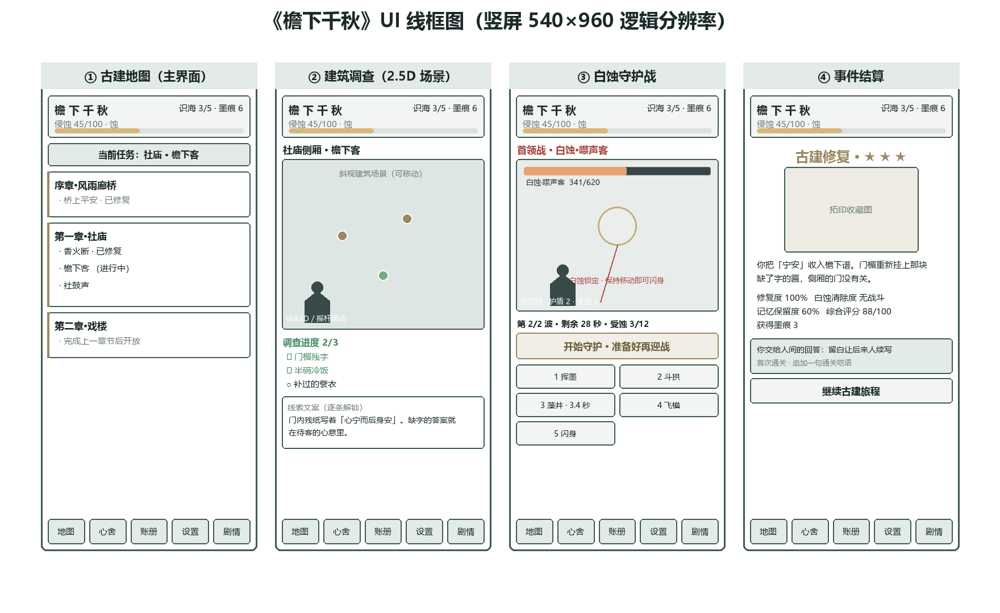
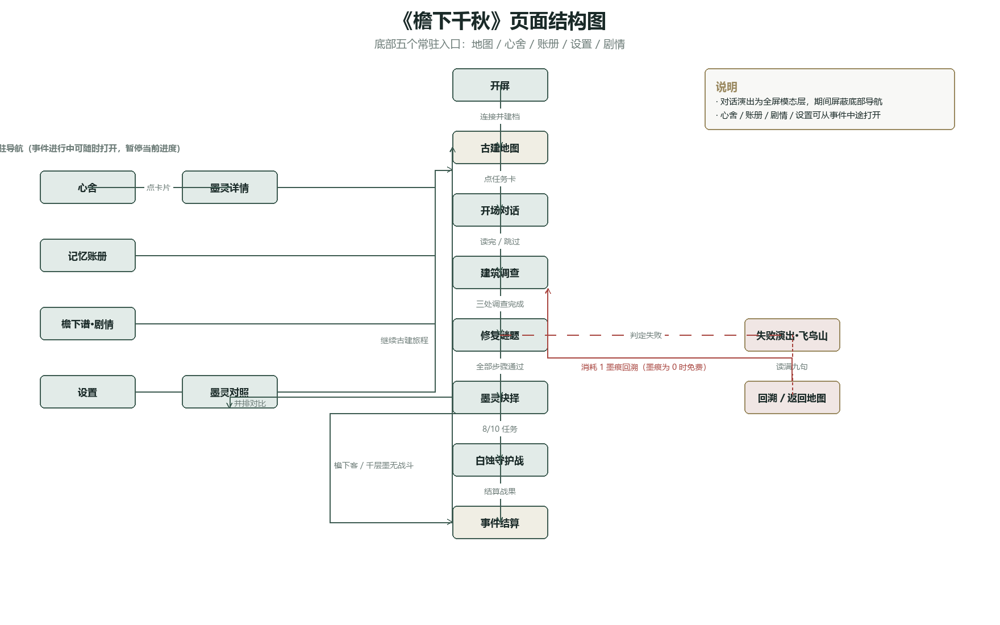
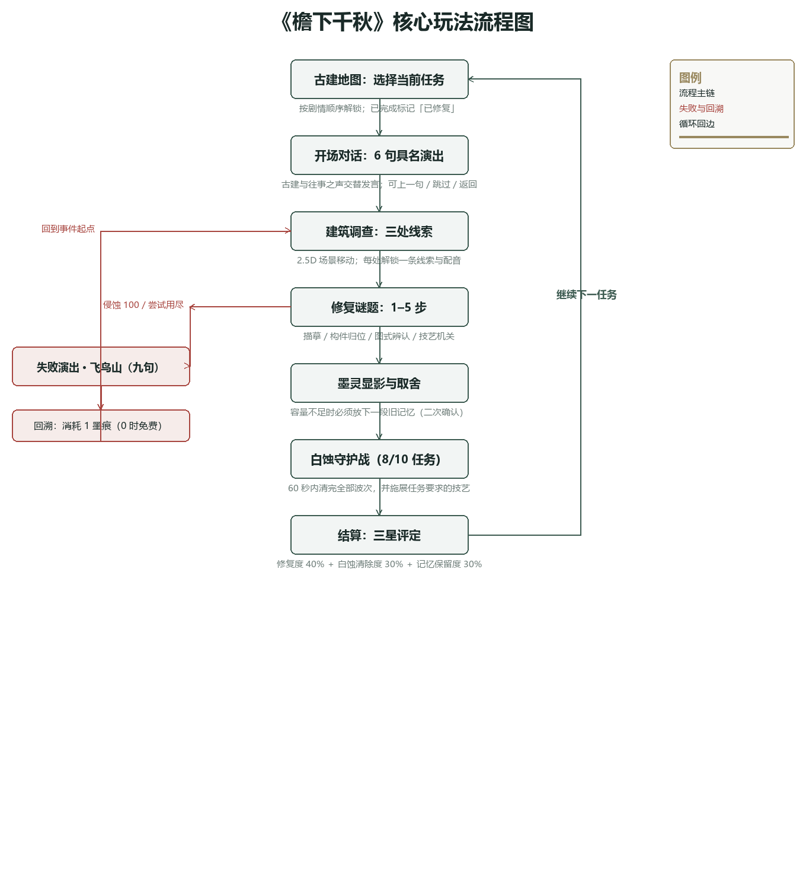

# 《檐下千秋》游戏策划案

---

**作品名称**：《檐下千秋》

**队伍 ID**：第二队

**组别**：本科组

**提交日期**：2026 年 9 月

---

> 本文档依据《2026 一带一路暨金砖国家技能发展与技术创新大赛·首届 AI 赋能数字创意设计与应用赛项》赛道一（交互赛道·小游戏开发方向）**Task01** 要求编制，并按评分表 1.1–1.6 六项考核内容组织章节。文档描述的是**当前已实现并可运行的 v10 版本**（内容协议 version 10），而非早期构想稿。

---

## 前言

《檐下千秋》是一款以中国传统建筑记忆为线索的单人国风解谜冒险小游戏。玩家在暴雨初歇的风雨廊桥醒来，手中只有一本空白册子《檐下谱》。通过调查、描摹、构件归位与守护，玩家替古建找回仍有人回应的往事，并最终理解{{白蚀}}为何产生——**它不是外敌，而是"被遗忘"本身的形状**。

本策划案的核心命题是：**保存文化，究竟是在保存完美的物，还是让活着的人继续回应它？**

游戏把这一命题转译为可操作的规则：{{心舍}}（承载记忆的识海）容量有限，初始 5 道、上限 7 道；全篇有 10 道{{墨灵}}，因此玩家在旅程中**必然要亲手放下至少 3 段记忆**。记住什么、遗忘什么没有标准答案，只有玩家自己的选择。这正是本作全部抉择玩法的起点，也是它区别于同类国风解谜作品的地方。

本文档与《AI 协作记录》配套提交，共同呈现本作品在 AI 辅助下由概念形成方案的全过程。

---

## 一、游戏概述与核心概念

> 对应评分点 **1.1 游戏概述与核心概念（4 分）**

### 1.1 游戏名称与核心概念

游戏名称定为**《檐下千秋》**，取意"**檐下藏千秋，墨中定存亡**"——中国古建的屋檐之下，承载着跨越千年的文明记忆。

**核心概念**：玩家扮演墨痕王朝最后的**拓印师**，以"{{拓印}}古建记忆"为核心能力，在"{识海只能承载数道记忆}"的伦理困境中对抗{{白蚀}}、抢救正在失忆的古建。作品将"遗忘什么、记住什么"这一抽象命题，转化为可操作的玩法规则与可感知的世界观法则。

### 1.2 游戏类型与定位

游戏类型定位为**国风解谜冒险 + 轻量守护战**。玩法重心为解谜与叙事：{{拓印}}衍生的技艺既是解谜工具，也是守护战中的手段；单场守护战限时 60 秒，确保战斗不打断叙事节奏。作品不含体力、抽卡、付费货币或等级养成，是完整的单机体验。

技术平台为 **Windows x64**（Godot 4.5.2 引擎，逻辑分辨率 540×960 竖屏，默认窗口 450×800）。操作设计同时覆盖鼠标与触控，移动端安装包尚未构建。

### 1.3 目标受众

目标受众为**偏好国风叙事、文化题材与轻解谜的 16–35 岁单机玩家**。该群体对传统文化接受度高，对"抉择—代价"类机制敏感，与作品"记忆伦理"主题高度契合。作品不含暴力与恐怖内容，节奏舒缓，适合单次 25–40 分钟的完整体验。

### 1.4 视觉风格

视觉风格以**国风水墨**为基调，与"墨痕／墨灵"的世界观相统一。场景以现实古建形制为蓝本（风雨廊桥、社庙、戏楼、官道牌坊、通天塔），经水墨化处理；人物为程序绘制的墨色剪影；界面采用**古卷轴**形态，正文区为可纵向滚动的"谱页"。

十道{{墨灵}}各有一张独立的**拓印收藏图**，以水墨拓片质感呈现，在{{心舍}}、抉择、对照与结算界面复用同一图片路径。

### 1.5 主题切入点与文化表达

主题切入维度为"**建筑文化的空间叙事**"。取材中国传统建筑承载"记忆"的文化内涵，涵盖风雨廊桥、社庙、戏楼、牌坊、{{斗拱}}、{{飞檐}}、{{藻井}}、{{榫卯}}、{{通天塔}}等典型建筑与构件。

设计理念遵循"**保留 + 现代化转译**"：完整保留榫卯咬合、墨线拓印、藻井纹样、四柱三间等传统建筑语汇，并将其转译为游戏内的谜题机制与技艺系统，使文化元素成为**可交互的玩法本体**，而非单纯的美术装饰。

三处具体转译：

| 传统语汇 | 玩法转译 | 叙事落点 |
|---|---|---|
| 榫卯咬合 | 拖动构件到榫口归位（吸附判定） | 齐心修屋——社庙主梁由各家余料抬来 |
| 墨线拓印 | 逐笔跟随墨线描摹，校验起收笔与连续性 | 把故事原样留下，不替人改写 |
| 四柱三间 | 图式辨认，识别柱数与开间 | 抬头看名字的人多，低头看结构的人少 |

### 1.6 核心特色与创新点

本作相较同类作品的核心创新体现为五点：

**其一，解谜驱动叙事，而非叙事装饰解谜。** 以古建构件的修复谜题推进剧情，{{榫卯}}归位、墨线{{拓印}}、形制辨认均承载叙事信息。谜题答案是剧情的必然结论，不是脱离故事的知识测验。

**其二，背包即伦理困境。** 背包系统"{{心舍}}"容量有限（初始 5 道、上限 7 道），而全篇共有 10 道{{墨灵}}。拓印新记忆而容量不足时，**必须亲手抹去一段旧记忆**，抹除伴随视听代价（画面褪色、对应回声消失），账册记下"在何时、为何替换"。资源管理由此升维为伦理抉择。

**其三，无传统 NPC。** 全部剧情由"**古建呓语**"发布：建筑本体与其中封存的往事之声（客声、童声、师父回声、匠人回声）承担全部台词，没有可移动的第三方角色。这一选择凸显了"建筑作为叙事主体"的文化立场，也营造出孤寂苍凉的沉浸氛围。

**其四，失败也是叙事。** 侵蚀满值不弹"游戏结束"，而是退到地图之外的**飞鸟山**，播完九句呓语，再照常回溯继续。失败被转化为一次可以被读到的对话，而非挫败感的惩罚。描摹失败更是**唯一不增加侵蚀**的玩法——练习不该被惩罚。

**其五，主题升维，不给标准答案。** 从"对抗邪恶"升华为"记忆伦理"抉择：终章三种回答**同分且均能完成旅程**，它们是收束方式的差别，不是善恶排名。作品拒绝替无名匠人编造名字，也拒绝把未经证实的补白当作历史。

### 1.7 一句话宣传语

> **「檐下藏千秋，墨中定存亡。」**

## 二、核心玩法与机制设计

> 对应评分点 **1.2 核心玩法与机制设计（5 分）**

### 2.1 核心循环

游戏的核心循环为**八步闭环**，在每个任务（事件）中完整走一遍：

```
古建地图 → 开场对话 → 三处线索调查 → 修复谜题 → 墨灵显影与取舍
        → 守护战（8/10 任务）→ 结算与结语 → 推进下一任务
```

展开说明：

1. **古建地图**：按{{章节}}顺序逐张解锁任务卡片；已完成任务标记"已修复"，可随时回看。
2. **开场对话**：每个任务 6 句具名对话，全屏演出、逐字显现，角色与古建交替发言。
3. **三处线索调查**：在 2.5D 斜视建筑场景中自由移动，调查三处highlight标记，每处解锁一条线索文案与配音。
4. **修复谜题**：按任务配置执行 1–5 步修复操作（描摹／构件归位／图式辨认／技艺机关／终章回应）。
5. **墨灵显影与取舍**：谜题通过后{{墨灵}}显影，玩家选择"拓印这道墨灵"或"以旧换新"（{{心舍}}容量不足时必须先放下一段旧记忆）。
6. **守护战**：8 个任务含守护战，在 60 秒内清除全部波次并施展任务要求的技艺。
7. **结算与结语**：按修复度、白蚀清除度、记忆保留度三项评定 1–3 星，播放结语与战后台词。
8. **推进**：回到地图，开放下一任务。

**玩家行为路径**：从风雨廊桥醒来 → 游历社庙、戏楼、牌坊 → 调查场景、聆听呓语 → 解谜获得墨灵符诏 → 为腾出识海空间不得不放下旧记忆 → 以技艺对抗白蚀、修复古建 → 抵达皇城通天塔，在三种回答中把续写记忆的权利交还人间。

### 2.2 操作机制

**基础操作**

| 场景 | 操作 | 说明 |
|---|---|---|
| 全部界面 | 鼠标左键 / 触摸点击 | 按钮统一最小高 48 像素，点击播放 UI 音效 |
| 建筑调查 | `WASD` / 方向键 | 自由移动水墨剪影 |
| 建筑调查 | 左下虚拟摇杆 | 按下半径 38 像素内触发拖拽 |
| 建筑调查 | 点击地面 / 调查点 | 自动寻路；点击调查点命中半径 38 像素 |
| 建筑调查 | `空格` / `回车` | 调查最近的未调查点 |
| 描摹拓印 | 鼠标左键拖拽 | 沿浅金容差带落墨，松开结束一笔 |
| 榫卯归位 | 鼠标左键拖拽 | 抓取构件后拖到榫口松手吸附 |
| 图式辨认 | 点击图案按钮 | 选项为图形而非答案文字 |
| 技艺机关 | 先选技艺、再点构件 | 点击锚点命中半径 49 像素 |
| 对话演出 | 点击任意处 / `空格` / `回车` | 推进下一句；`←` 上一句；`Esc` 返回 |
| 守护战 | 点击技能按钮 | 见下方固定快捷键 |
| 守护战 | 左下虚拟摇杆 | 移动闪避，按下半径 42 像素 |

**守护战固定快捷键**（主键盘与数字小键盘均可）：

| 按键 | 技能 |
|---|---|
| `1` | 挥墨 |
| `2` | 斗拱 |
| `3` | 藻井 |
| `4` | 飞檐 |
| `5` | 闪身 |

未习得的技艺不响应；战斗准备页、非战斗页与结算后不响应；长按产生的系统重复事件被忽略；所有输入遵守同一冷却。按钮上直接标注编号，与提示文案一致。

### 2.3 核心规则（目标与胜负）

**目标**：修完五章十任务，理解白蚀为何产生，并在终章把续写记忆的权利交还人间。

**{{识海}}容量规则**：初始 **5 道**；社鼓声结算后扩为 **6 道**；无名匠结算后扩为 **7 道**（上限）。全篇共 10 道墨灵，每道占 1 格，因此**全程必然至少主动放下 3 段记忆**。

**拓印规则**：容量不足时必须先择一旧记忆抹去，抹除需**二次确认**；抹除后对应色调与心舍回声消失，**已习得的技艺仍然保留**；账册记录该次替换发生的时间与事件。

**胜负条件**：

- **谜题**：提交正确答案即通过；非描摹谜题失败会累积错误次数，超过上限判定事件失败。**描摹失败不增加侵蚀、不消耗尝试次数**，仅标红该笔供重描。
- **战斗**：清完全部波次 + 未超出受蚀上限 + 累计侵蚀未达 100 + 施展过任务要求的全部技艺 = 获胜。
- **事件失败**：侵蚀达 100、谜题尝试次数用尽、或守护战未达成要求时，本次事件判定失败。

**进度资源**：无金币、无体力、无抽卡。唯一进度资源为**{{墨痕}}**，按事件星级发放（1 星 1 点、2 星 2 点、3 星 3 点）。

### 2.4 谜题机制（五类）

修复谜题由若干**步骤**串联，每个任务 1–5 步。步骤类型共五类：

**（一）墨线拓印（trace）** —— 本作核心操作

跟随浅金容差带逐笔落墨，把古建上的刻字原样复制下来。

- **容差**：以画布高度为单位，`tolerance = 0.14`；显示为浅金半透明带，玩家"沿笔势落墨即可，不必压在线心"。
- **判定维度（全部在服务端）**：笔数与笔顺完全一致、方向单调递进、起点与终点到位、连续性（出带采样点不超过 10%）、单点偏离不超过 1.6 倍容差、相邻采样点跳距不超过 0.12、允许 2 倍容差的轻度回描。
- **多字支持**：`aspect_ratio` 2.4 表示双字（每字占一半横坐标，笔画不可横跨两字），1.2 表示单字；客户端按字放大并横向翻页。
- **失败反馈**：服务端返回**失败笔画索引**，客户端标红并显示编号与红叉，玩家点击编号即可**只重描该笔**，其余正确笔画保留。
- **容错设计**：描摹是本作唯一**失败不扣侵蚀、不消耗尝试次数**的玩法——练习不该被惩罚。

**（二）构件归位（join）**

拖动榫卯构件到榫口，松手吸附。

- 抓取判定：构件中心 76×76 像素矩形内；
- 吸附判定：松手点到榫口中心距离 ≤ **44 像素**即吸附成功；
- 取消方式：拖到槽位 44 像素以外松手即回弹，可反复尝试；
- 叙事对应：社庙主梁"由各家余料抬来"，玩家按左、中、右承重点依次归位。

**（三）图式辨认（choice + pattern）**

从一排图形选项中辨识正确的形制或行当。选项以**图形**呈现，不直接使用答案文字：

- 屋架类：四柱三间 / 三柱两间 / 两柱一间，绘制对应柱数、额枋与屋顶折线；
- 行当类：旦（圆脸＋双髻＋水袖）/ 净（圆脸＋交叉＋额饰）/ 生（圆脸＋冠带＋三角）。

图式为**玩法示意**，不作为古建或戏曲文物的测绘依据；答案由本任务的调查线索推得。

**（四）技艺机关（skill）**

在同一场景中同时呈现三处机关锚点，玩家**先选技艺、再点作用位置**：

| 技艺 | 作用锚点 | 画面反馈 |
|---|---|---|
| 斗拱 | 梁架（承重） | 梁架扶正、连杆接通 |
| 飞檐 | 远端风铃 | 风铃作响、高处刻痕显影 |
| 藻井 | 白蚀碑面 | 白斑消退、墨线显影 |

机关有**顺序与条件依赖**：无名匠须先承重再触发远端；登塔须先描摹、再承重、最后净化。目标错误或顺序错误会被拒绝，无法靠单点技能按钮跳过。已完成的承重状态由服务端已接受步骤恢复，返回心舍再进入时仍然保留。

**（五）终章叙事回应（narrative）**

终章"千层墨"的收束步骤，玩家在三种回答中选择其一。**三种回答同分且均能完成游戏**，不是知识题，也没有唯一正解（详见 3.6）。

### 2.5 守护战机制

**技艺表**（五项，`挥墨`与`闪身`为无条件基础技艺）：

| 技艺 | 伤害 | 护盾 | 净化 | 冷却 | 设计意图 |
|---|---|---|---|---|---|
| 挥墨 | 10 | — | — | 0.5 秒 | 基础攻击，任何情况下可用 |
| 斗拱 | — | 2 次 | — | 6 秒 | 承重／防御，对应"稳固性" |
| 飞檐 | 25 | — | — | 4 秒 | 远程攻击，对应"延伸性" |
| 藻井 | 18 | — | 1 次 | 6 秒 | 伤害并消除本场 1 次受蚀，对应"清明性" |
| 闪身 | — | 1 次 | — | 2.5 秒 | 预警时移动即可触发，抵消下一次侵袭 |

**规则要点**：护盾取较大值而非相加；藻井的净化冲抵本场已受蚀次数，不清除进入本场前的侵蚀；伤害不跨波溢出；战斗时钟在离开战斗页时暂停。

**敌人配置**（共 8 场；`檐下客`与`千层墨`不含守护战）：

| 任务 | 波数 | 每波生命 | 首领 | 必用技艺 |
|---|---|---|---|---|
| 桥上平安 | 1 | 640 | — | 斗拱 |
| 香火断 | 1 | 680 | — | 斗拱 |
| 社鼓声 | 1 | 740 | — | 藻井 |
| **开场锣** | **2** | 300 | **白蚀·噤声客**（620 生命／2.4 秒侵袭） | 斗拱、藻井、飞檐 |
| 名角儿 | 1 | 1000 | — | 飞檐 |
| 四柱三间 | 2 | 520 | — | 飞檐 |
| 无名匠 | 2 | 540 | — | 斗拱、飞檐 |
| 登塔 | 3 | 360 | — | 斗拱、飞檐、藻井 |

**共同参数**：单场限时 60 秒；普通敌人每 3 秒侵袭一次；每场最多容许 12 次净受蚀，第 13 次或累计侵蚀达 100 即失败。

**攻击预警与闪避**：敌人侵袭前有明显的视觉预警——变暖色、画出锁定线，并提示"白蚀锁定 · 保持移动即可闪身"。玩家在预警窗口内保持移动即自动触发闪身，抵消该次侵袭。

**防作弊设计**：客户端**不能自行声明战果**。服务端逐条重放客户端上报的动作时间线，独立重算技能归属、冷却、伤害、护盾、净化、推波与终止时刻；请求中携带的"已清波数""受蚀次数"字段被服务端**忽略**。掌门战（开场锣）另有一条硬性要求：必须施展过全部三项技艺。

### 2.6 侵蚀、失败与回溯

**侵蚀度**是全旅程状态，取值 0–100，替代传统生命值。

**增减数值**

| 事件 | 变化 |
|---|---|
| 非描摹谜题失败 | **+10**（一般任务三次失败即事件失败；登塔为五次） |
| 描摹失败 | **0**（不惩罚练习） |
| 守护战中每被侵袭一次 | **+5** |
| 守护战失败 | 另 **+15** |
| 阅读对话、调查、查看心舍、战斗准备 | 0（不计时、不增加） |

**三阶段视觉反馈**（客户端按侵蚀值呈现）

| 阶段 | 区间 | 视听表现 |
|---|---|---|
| **浸** | 0 ≤ 侵蚀 < 40 | 建筑褪色、声音减弱 |
| **蚀** | 40 ≤ 侵蚀 < 70 | 构件崩解、裂纹显现、呓语失真 |
| **竭** | 70 ≤ 侵蚀 ≤ 100 | 屋顶消失、柱梁倒塌为残迹；回声音轨叠加失真 |

侵蚀还会实时驱动两处细节：顶栏进度条颜色，以及墨灵回声所在音频总线的音量（每点侵蚀降低 0.12 分贝，达 40 起启用失真效果）。

**侵蚀达 100 的后果**：本次事件失败，会话冻结；**但不会永久失去任何内容**。

**失败演出 · 飞鸟山**：事件失败后先进入一段九句呓语演出，而非直接弹回。

- "飞鸟山"是全篇唯一不在地图路线上的地点：石阶上落着没能带回去的记忆，阶顶是一座没有匾额的旧亭。
- 演出**不可跳过、不可回退**，必须读到第九句；第九句结束后才显示回溯与返回地图入口。
- 首句随失败原因变化（侵蚀耗干／尝试用尽／白蚀未清／旧版事件超时），后八句固定。
- 演出**不写入结算，也不改变终章回答**，已拓印的记忆、已学技艺与已确认的取舍全部保留。

**回溯机制**

| 项 | 规则 |
|---|---|
| 费用 | 有墨痕时消耗 **1 点**；**墨痕为 0 时免费**，避免失败会话阻断主线 |
| 恢复 | 侵蚀回到本事件起点值；谜题步骤清空；本场战斗清空 |
| 保留 | 已获墨灵与账册、已习得技艺、**已确认的记忆取舍**、已消耗的墨痕 |
| 幂等 | 重复请求只恢复一次、只扣费一次 |

**制作边界说明**：本作的"残迹"是**可回溯的视觉状态**，不再承诺侵蚀满值导致永久消散或不可逆的剧情分支。主动抹去的记忆会失去图录持有与回声，但技艺保留——这两种后果在文案中已作区分。

### 2.7 结算与经济系统

**三项结算指标**（任务完成时计算并存档）

| 指标 | 公式 | 权重 |
|---|---|---|
| **修复度** R | 已得谜题分 ÷ 谜题总分 × 100 | **40%** |
| **白蚀清除度** B | 已清波数 ÷ 总波数 × 100；无战斗任务固定为 100，界面显示"无战斗" | **30%** |
| **记忆保留度** M | 结算时持有墨灵数 ÷ 历史获得的不同墨灵数 × 100 | **30%** |

**综合评分与星级**

```
综合分 Q = (R×40 + B×30 + M×30) ÷ 100
         − min(20, 非描摹错误次数 × 5)
         − (侵蚀 ≥ 70 ? 15 : 0)
         → 钳制到 0–100

Q ≥ 85 → 三星　｜　60 ≤ Q < 85 → 二星　｜　Q < 60 → 一星
```

**举例**：完整修复、白蚀全部清除、保留 7/10 段记忆、无额外扣分时为 **91 分三星**；只保留 1/10 时为 **73 分二星**。有限容量的正常取舍仍允许三星——**取舍本身不是扣分项，容量不足也不是失败**。

**经济模型**

| 项 | 值 |
|---|---|
| 墨痕获取 | 完成事件获得与星级相同的墨痕（1–3 点）；重玩已完成事件不再获得 |
| 墨痕消耗 | **回溯重试 1 点**（墨痕为 0 时免费） |
| 章节解锁 | **0 墨痕**，按剧情顺序自动开放 |
| 无付费货币 / 体力 / 抽卡 / 等级 | 是 |

**设计原则**：无传统货币、无体力，避免惩罚性设计；"侵蚀 + 可回溯的失败演出"取代失败挫败感，把失败转化为可被阅读的剧情体验。

### 2.8 难度成长曲线

| 章节 | 教学／机制引入 | 谜题复杂度 | 白蚀强度 |
|---|---|---|---|
| 序章·风雨廊桥 | 首次对话、调查、描摹；学会斗拱 | 单步描摹 | 1 波 |
| 第一章·社庙 | 构件归位、补字、净化；学会藻井；容量 +1 | 单步到多步 | 1 波 |
| 第二章·戏楼 | 行头辨认、图式选择；学会飞檐；**首领战** | 多步＋图式 | 2 波＋首领 |
| 第三章·牌坊 | 条件机关与技艺组合；容量 +1 | 条件谜题 | 2 波 |
| 第四章·通天塔 | 全机制综合；三波递增 | 综合谜题 | 3 波 |

难度提升主要由三项驱动：**谜题步数**（单步 → 条件组合）、**波次与生命**（1 波 640 → 3 波 360×3）、**必用技艺数**（1 项 → 3 项）。

### 2.9 时长规划

| 项 | 设计值 |
|---|---|
| 单个任务 | 5–8 分钟（以解谜与阅读为主体） |
| 单场守护战 | 30–60 秒，硬上限 60 秒 |
| 全篇总时长 | **约 25–40 分钟**（五章十任务） |
| Task03 演示范围 | 完整序章＋社庙章节，满足赛题"不少于 3 分钟可体验内容"并留有余量 |

**说明**：守护战的目标时长是依据真实冷却与伤害模型校准的，**不插入任何强制等待**（自动化回归以 0.5 秒与 0.75 秒两种出手间隔验证 8 场战斗均落在 30–60 秒区间）。全篇总时长仍需真人试玩校准，本策划案不将目标时长视作实测承诺。

## 三、系统设计与游戏世界剧情

> 对应评分点 **1.3 系统／配件设计与世界观剧情（5 分）**

### 3.1 角色系统

**设计前提：本作没有传统 NPC。** 全部剧情由"**古建呓语**"传递——建筑本体与其中封存的往事之声承担全部台词，没有可移动的第三方角色。这一选择凸显了"建筑作为叙事主体"的文化立场，也营造出孤寂苍凉的沉浸氛围。

**主角：拓印师**

- 墨痕王朝最后的拓印师，在风雨廊桥醒来时**已失去自己的名字与记忆**，手中只有一本空白《檐下谱》。
- 设定上，失忆**不是剧情漏洞，而是成为拓印师的必要条件**：承载他人记忆需要"**无我识海**"——没有自己的记忆定见，才能成为他人记忆的容器。空白《檐下谱》与空白识海互为表里。
- 形象为程序绘制的墨色水墨剪影（袍身、头、帽、手臂与笔），带呼吸式摆动；无独立立绘与骨骼动画。
- 全程 60 句开场对话中占 21 句，是台词量最大的角色。主角**不设固定姓名**，全篇以其身份「拓印师」称谓——「无名」本身即是设定的一部分，与其失忆后承担他人记忆的资格互为表里。

**在场声部（古建本体）**

| 角色 | 身份与主题 | 句数 |
|---|---|---|
| **檐下谱** | 记事与旁白声部，兼"记忆账册"的人格化；每个事件的第一句均由它叙述环境 | 10 |
| **社庙** | 第一章社庙本体的"通声"；主题＝齐心修屋、檐下不拒客、香火可再点 | 5 |
| **牌坊** | 第三章官道牌坊本体；主题＝抬头看名字的人多，低头看结构的人少 | 3 |
| **廊桥** | 序章风雨廊桥本体；主题＝等人归来 | 2 |
| **戏楼** | 第二章戏楼本体；"台上的人以为没人来了，台下的人以为不开戏了" | 2 |
| **墨塔** | 第四章通天塔本体；"不要替我辩解，替后来的人打开门。" | 1 |
| **飞鸟山** | 失败结局场景兼说话者（见 2.6 与 3.6） | 4（失败演出内） |

**回声类记忆之声**（建筑保存的往事，不另加可移动角色）

| 回声声部 | 身份 | 句数 |
|---|---|---|
| 牌坊·匠人回声 | 无署名营造者；"别猜。猜出来的名字会盖住真正的空白。" | 3 |
| 初代拓印师·塔中回声 | 白蚀源头的当事人，为永恒秩序抹去战乱与悲痛 | 3 |
| 社庙·客声 | 雨夜借檐的过路人，庙祝先推给他一碗饭 | 2 |
| 社庙·童声 | 敲不响鼓、在旁边数"一、二、三"的孩子 | 2 |
| 戏楼·旦角回声 | 行头箱上的旦角残存之声，"不是箱上那块褪色的标签" | 2 |
| 戏楼·师父回声 | 名角师父，最后一口气用来教孩子接下一句 | 2 |
| 廊桥的回声 / 戏楼的回声 | 千层墨中回应"你的名字" | 各 1 |

**成长体系**：不设等级、经验值与属性成长。玩家成长完全由**叙事驱动**——通过获得新的{{墨灵}}符诏（技艺）与{{心舍}}容量扩充实现。这意味着成长曲线与剧情进度**严格同步**，不会出现"练级跳过剧情"或"卡关刷资源"的情况。

### 3.2 经济与数值系统

**资源种类**

| 资源 | 性质 | 获取 | 消耗 |
|---|---|---|---|
| **墨痕** | 唯一进度资源 | 完成事件，数量＝星级（1–3 点） | 回溯重试 1 点（墨痕为 0 时免费） |
| **心舍容量** | 承载位 | 初始 5 格；社鼓声结算 +1；无名匠结算 +1 | 拓印新墨灵时占用，每道 1 格 |
| **侵蚀度** | 失败风险条 | — | 见 2.6 |

**核心数值表**

| 数值 | 定义 | 取值 |
|---|---|---|
| 心舍容量 | 可承载墨灵数 | 初始 **5** → 社庙章末 **6** → 牌坊章末 **7**（上限） |
| 墨灵总数 | 全篇可获得的不同墨灵 | **10** 道，每道占 **1** 格 |
| 侵蚀度 | 事件失败风险条 | 0–100；谜题失败 +10／受击 +5／战败 +15；描摹失败 0 |
| 墨痕 | 进度资源 | 1 星 1 点、2 星 2 点、3 星 3 点 |
| 修复步骤 | 全篇谜题步骤总数 | **22** 步（描摹 6／归位 6／技艺 5／辨认 3／叙事 1） |
| 守护战 | 场次与时长 | **8** 场；每场限时 60 秒，目标 30–60 秒 |

**容量设计的叙事理由**：墨灵与承载者的情感产生共鸣，**承载越多，自身记忆越被稀释**——"记别人的事，就会忘自己的事"。上限 7 与通天塔七层、七天七夜营建的传说呼应。全篇 10 道墨灵、上限 7 格，因此玩家**必然至少放下 3 段记忆**，这是设计刻意保留的取舍空间。

**数值设计原则**：无传统货币、无体力、无随机抽卡、无付费内容；不设惩罚性设计。有限容量的正常取舍**不扣分**——保留 7/10 即可达成三星。

### 3.3 背包与道具系统（心舍 · 墨灵 · 檐下谱）

**背包即"心舍"**，即主角的识海。它同时承担三个功能：收藏图录、技艺来源、伦理抉择的载体。

**界面呈现**：两列网格铺开已持有的墨灵，每格显示拓印收藏图与"名称／技能 · 占用格数"；不足的格位以禁用按钮"**空符诏格**"补齐，直观呈现剩余容量。下方"技艺册"逐条列出挥墨与已习得技艺及其说明。

**十道墨灵完整名录**

| 序号 | 名称 | 获得事件 | 能力 | 记住的文案 |
|---|---|---|---|---|
| 1 | **檐·平安** | 序章·桥上平安 | 斗拱 | 桥记着每一次送别与归来。 |
| 2 | **社·承香** | 香火断 | 斗拱 | 一炷香把一村人的愿望托给屋梁。 |
| 3 | **社·宁安** | 檐下客 | 藻井 | 檐下不拒客，一碗冷饭也分半碗。 |
| 4 | **社·回春** | 社鼓声 | 藻井 | 鼓声唤回春社，也唤回孩子们的脚步。 |
| 5 | **戏·行腔** | 开场锣 | 飞檐 | 一腔唱尽台上台下的悲欢。 |
| 6 | **戏·绝唱** | 名角儿 | 飞檐 | 记住绝唱，就要面对被抹去的童年社戏。 |
| 7 | **坊·无名** | 四柱三间 | 飞檐 | 无名匠人的手艺也值得被记住。 |
| 8 | **坊·匠魂** | 无名匠 | 斗拱 | 名字可以被风吹散，手艺留下的结构不会。 |
| 9 | **塔·初代之忆** | 登塔 | 藻井 | 初代拓印师为永恒秩序抹去了所有战乱与悲痛。 |
| 10 | **塔·檐下折中** | 千层墨 | —（终章收束） | 只记住值得记住的，让世界自己选择颜色。 |

**技艺分布**：斗拱 3 道（檐·平安、社·承香、坊·匠魂）、藻井 3 道（社·宁安、社·回春、塔·初代之忆）、飞檐 3 道（戏·行腔、戏·绝唱、坊·无名）、无技艺 1 道（终章）。三项技艺首次习得节奏与章节教学一致：序章得斗拱 → 社庙得藻井 → 戏楼得飞檐。

**每道墨灵都是一张拓印收藏图**：10 张图各自独立构图与主题，离线生成并随包提供；运行时只读取静态图片，**游戏本身不调用生图接口**。图缺时显示"拓印图待装裱"，不伪称已生成。

**取舍机制（核心伦理设计）**

| 机制 | 规则 |
|---|---|
| 拓印 | 容量足够时可直接收录 |
| 以旧换新 | 容量不足时必须先择一旧记忆抹去，**二次确认**（确认框为"亲手抹去"／"留下这段记忆"） |
| 抹除的代价 | 对应色调与心舍回声消失；**已习得的技艺保留** |
| 抹除的记录 | {{记忆账册}}记下"在何时、为何替换"，永久可查 |
| 回望 | 抉择页可"并排对比"新旧两道记忆（图案／摘要／技能／遗忘后文案） |

**技艺的持久性**：已习得的技艺依据记忆账册保留——玩家抹去的是"记忆"，不是"能力"。这一设定避免了"为了通关最优解而不得不保留某道记忆"的压力，让取舍回归叙事本身。

### 3.4 游戏世界：时间、地点与背景

**一句话世界观**：**记住，即存在；遗忘，即侵蚀。**

**时间**：架空古风王朝"**墨痕王朝**"。采用架空而非绑定具体朝代，是为了在不失中国传统建筑神韵的前提下，为玩法与剧情留出创作空间。

**地点**：玩家的旅程自乡野一路通向皇城，地理上的层层递进暗合文明由乡土走向庙堂的脉络。

| 顺序 | 场景 | 事件 | 地理脉络 |
|---|---|---|---|
| 1 | 风雨廊桥 | 桥上平安 | 乡野起点，半塌的桥 |
| 2–4 | 社庙（正殿／侧厢／前坪） | 香火断、檐下客、社鼓声 | 村落信仰中枢 |
| 5–6 | 戏楼（后台／舞台） | 开场锣、名角儿 | 城镇娱乐空间 |
| 7–8 | 官道牌坊（正面／背面） | 四柱三间、无名匠 | 礼制与功名 |
| 9–10 | 通天塔（七层／记忆长廊） | 登塔、千层墨 | 皇城深处，终点 |

另有唯一不在地图路线上的地点：**飞鸟山**（只有失败时才会退到这里）。

各章之间的行进线索由结语自然串联：桥尾"雾后露出一条山路，路尽头的社庙正传来细弱的咳声" → 社庙前坪"远处戏楼以一声锣响回应" → 名角儿"通往石牌坊的门打开了" → 无名匠"刻痕连成通向七层墨塔的路线"。

**世界规则：建筑如何承载记忆**

这是一片**建筑会"记住"事情**的土地。建造者的手艺、节庆的仪式、行人的悲欢，都会随年月沉淀进砖瓦木石之中，凝结成肉眼看不见的灵质——{{墨灵}}。这套"建筑承载记忆、记忆维系文明"的秩序，被称为**建筑意**。

记忆的沉淀遵循三级结构：

| 层级 | 沉淀位置 | 举例 |
|---|---|---|
| 技艺之忆 | 构件 | 榫卯手法、营造口诀、斗拱形制 |
| 仪礼之忆 | 空间仪式区 | 香炉、戏台、鼓坪 |
| 情感之忆 | 器物 | 匾额、蓑衣、鼓槌 |

这也解释了玩法与叙事的对应关系：**调查点即记忆沉淀点**——玩家在建筑中调查三处，本质上是在读取三层记忆。

**白蚀：不是外来敌人，而是"被遗忘"的形状**

当一段记忆被遗忘——也许是岁月冲刷，也许是人们不再提起——它就会从建筑中消散，并在消散之处凝成灰白色的侵蚀物，即**白蚀**。白蚀会像瘟疫一样侵蚀邻近建筑，形成加速循环：

> 遗忘 → 墨灵失载 → 逆结晶为白蚀 → 侵蚀邻近建筑 → 更多记忆被抹除 → 更多人遗忘 → 循环加速

因此**被白蚀吞没的庙宇会褪色剥落，乡民也会渐渐忘记自己从何而来**。这并非外敌入侵，而是"被遗忘"本身化成了可见的形状。作品中白蚀的形态始终是"白斑""白化""纸越白、人的轮廓越淡"这类失忆意象，而非怪物。

**拓印：记忆的拯救方式**

能对抗白蚀的，唯有拓印师的手艺——将建筑中的记忆原样临摹下来，封存为{{墨灵符诏}}。但识海容量有限，**每拓印一段新记忆，往往就要亲手抹去一段旧记忆**。

值得强调的是：拓印是**复制并庇护**，不是夺取。被拓印的建筑反而因"被记住"而稳固——这正是"被记住即存在"主题的机制化表达。

### 3.5 剧情主线：五章十任务

| 章 | 章名 | 章节摘要 | 主题定位 | 任务 |
|---|---|---|---|---|
| 序章 | **风雨廊桥** | 暴雨初歇，拓印师在半塌的风雨廊桥醒来。 | 教学：对话、调查、描摹；记住等待归来的人；习得斗拱 | 桥上平安 |
| 第一章 | **社庙** | 山间社庙香火断绝，三处古建记忆等待修复。 | 由合力修梁走向接纳陌生人与共同节庆；习得藻井；**容量 +1** | 香火断、檐下客、社鼓声 |
| 第二章 | **戏楼** | 戏班绝响散在空场，飞檐记忆等待重新入腔。 | 提出"**不完美是否值得保存**"；习得飞檐；**首领战** | 开场锣、名角儿 |
| 第三章 | **牌坊** | 名与实刻在四柱三间之间，无名匠人的墨线仍未干。 | 追问"**谁被允许留名**"；条件机关与技艺组合；**容量 +1** | 四柱三间、无名匠 |
| 第四章 | **通天塔** | 白蚀源头在塔顶，初代拓印师封存的终极记忆等待选择。 | 完成**因果揭示**；三波递增；终章回答 | 登塔、千层墨 |

**十个任务一览**

| 序号 | 任务 | 场景 | 内容 | 墨灵 |
|---|---|---|---|---|
| 1 | **桥上平安** | 风雨廊桥 | 雨停后在桥心醒来，拓回正在褪色的"平安"二字，为刚显影的刻字守住白蚀 | 檐·平安 |
| 2 | **香火断** | 社庙正殿 | 主梁悬在半空，按左、中、右归位燕尾榫与承重斗，记住"凑料修屋的齐心" | 社·承香 |
| 3 | **檐下客** | 社庙侧厢 | 补出"□安"缺的"宁"，拓回"心宁而后身安"的待客之意（**无守护战**） | 社·宁安 |
| 4 | **社鼓声** | 社庙前坪 | 先用藻井净化鼓面白蚀斑，再沿显影出的鼓纹拓印，敲响春社鼓声 | 社·回春 |
| 5 | **开场锣** | 戏楼后台 | 辨认水袖与凤冠的行当，拓回开场节拍；习得飞檐后迎战首领（**唯一首领战**） | 戏·行腔 |
| 6 | **名角儿** | 戏楼舞台 | 把第一步落在"梅"位、对齐水袖纹布景板，不让绝唱永远循环，替它接上徒弟的新声 | 戏·绝唱 |
| 7 | **四柱三间** | 官道牌坊 | 辨认四柱三间形制、归位匾额托斗，让柱脚没有署名的手印显形 | 坊·无名 |
| 8 | **无名匠** | 牌坊背面 | 用斗拱承住摇晃的牌坊、再用飞檐点亮高处刻痕，把可照着修的记录显影出来 | 坊·匠魂 |
| 9 | **登塔** | 通天塔七层 | 拓印塔心第一道墨线、承住第七层、净化逆结晶，直面初代拓印师抹忆的后果 | 塔·初代之忆 |
| 10 | **千层墨** | 通天塔记忆长廊 | 回望亲手拓下与亲手放开的记忆，在三种回答中把笔交还人间（**无守护战**） | 塔·檐下折中 |

**主题的四层递进**（均以游戏内台词落地）：

其一，**记住的是人，不是物**。廊桥："字是门，走过这里的人才是屋里的灯。"

其二，**承认有限，不假装全知**。名角儿："谱页有限，抉择会痛。但别把'不完美'误认成'不值得'。"

其三，**不编造补白**。无名匠："别猜。猜出来的名字会盖住真正的空白。记下你确实看见的手、工具和做法。"——作品因此拒绝替无名匠人编造名字。

其四，**不替所有人决定**。初代拓印师："这支笔不该替所有人决定。你愿意把它交回去吗？"

**对立面的主张**：初代拓印师为消灭痛苦而系统性抹忆——"我抹去战乱，抹去离别，抹去羞耻与失败。我只想让他们不再痛。"其代价由主角点破："可你也抹去了为什么相助，为什么重建，为什么等一个人回来。"而初代自己的困惑正是全篇的题眼：**"我留下了完好的屋子，为什么里面越来越空？"**

**叙事呈现方式**

| 机制 | 条数 | 位置 |
|---|---|---|
| 开场对话 | **60 句**（每任务 6 句） | 每个任务的全屏对话演出 |
| 调查线索 | **30 条**（每任务 3 条） | 建筑调查场景，每处调查点一条 |
| 往事独白 | **30 条**（每任务 3 条） | 三处线索全部找到后顺序展开，支持"重听这段往事" |
| 取舍回应 | **20 条**（每任务记住／遗忘各 1 条） | 墨灵显影与取舍之后 |
| 守护前对白 | 9 条 | 进入守护战前 |
| 结语 | **10 条** | 每任务结算后 |
| 章末呓语 | 1 条 | 社庙章末，指向戏楼 |
| 通关呓语 | 2 条 | 戏楼两个任务**首次通关**时各一次 |
| 失败呓语 | 9 句 + 4 条首句变体 | 失败演出·飞鸟山 |
| 墨灵回声 | **10 条** | 心舍墨灵详情页"聆听墨灵回声" |

对话采用全屏演出、画面淡入、台词逐字显现；点击任意处或按空格／回车推进，支持上一句、跳过与返回；阅读位置自动保存，重访可续读，读完后标记"已读 · 跳过"。查看心舍、账册、剧情册与设置时，当前调查与战斗暂停，不影响已提交进度。

**全篇 184 段中文配音**已覆盖全部叙事台词（60 对话 + 30 线索 + 30 往事 + 20 取舍 + 9 战前 + 10 结语 + 1 章末 + 2 通关 + 12 失败 + 10 回声 = 184）。失败演出第八句为"……"，**按设计静默无录音**。

### 3.6 结局设计

**终章不是只有一个标准答案的知识题。** 千层墨的最后一步，玩家在三种回答中选择其一：

| 回答 | 后日谈落点 |
|---|---|
| **传下修复的方法** | 回答落到工坊学徒——手艺被交到下一代手上 |
| **留下所有取舍的记录** | 回答落到一本带批注的记忆册——选择本身被诚实地留下 |
| **留白让后来人续写** | 回答落到孩子新画的小棚——古建第一次听见未来的声音 |

**三条回答同分、均能完成游戏**，不存在最优解。玩家首次确认的回答持久保存，重连、重试与剧情回顾均不能覆盖它。作品在此明确拒绝"一条道路必然正确"的价值判断——**它们是收束方式的差别，不是善恶排名**。

**失败结局 · 飞鸟山**（与终章回答并列但性质不同）

- 它**不是第四种回答**，不改变三种终章回答的数量，也不阻断旅程。
- 事件判定失败时，失败页先播放九句呓语，播完仍显示回溯按钮；回溯后照常继续，已拓印记忆、已学技艺与已确认的取舍全部保留。
- 首句按失败原因变化，后八句固定。演出**不写入结算，也不覆盖已确认的终章回答**。

飞鸟山的场景意象——"石阶上落着所有没能带回去的记忆，阶顶是一座没有匾额的旧亭"——让失败成为一次可以被读到的对话，而非一次惩罚。

## 四、可视化表达

> 对应评分点 **1.4 可视化表达（7 分）**：页面结构与玩法流程图完整清晰

本节给出赛题 Task01 要求的三项图稿：**UI 线框图**（界面设计意图）、**页面结构图**（页面层级与流转关系）、**核心玩法流程图**（单次任务的完整闭环）。界面元素均由代码构建，统一遵循以下规范：

| 元素 | 规范 |
|---|---|
| 顶栏 | 作品名 · 识海 已用/总量 · 墨痕 · 侵蚀阶段与进度条 |
| 正文区 | 纵向滚动"谱页"；标签 18 号，自动换行 |
| 按钮 | 最小高 48 像素；四态配色（常态／悬停／按下／禁用）；点击播放 UI 音效 |
| 底部导航 | 五列常驻：地图 · 心舍 · 账册 · 设置 · 剧情 |
| 战斗操作栏 | 战斗时在正文与导航之间插入，两列技艺按钮 |

### 4.1 UI 线框图

下图为四个核心界面的线框设计，展示顶栏、正文区、底部导航与战斗操作栏的层级关系：① 古建地图、② 建筑调查、③ 白蚀守护战、④ 事件结算。



### 4.2 页面结构图

游戏共 **16 个页面态**，主链为纵向顺序，底部五个入口在加载完成后常驻（对话演出期间为全屏模态层）。图中实线为主流程，红色虚线为失败与回溯支线。



**页面清单**：开屏 / 古建地图 / 开场对话 / 失败演出 / 失败操作 / 建筑调查 / 修复谜题 / 墨灵抉择 / 白蚀守护战 / 事件结算 / 心舍 / 墨灵详情 / 墨灵对照 / 记忆账册 / 檐下谱·剧情 / 设置。

**主页面的流转规则**：由统一的"恢复分发"逻辑驱动——每次谜题提交、抉择确认或战斗结算后，客户端都向服务端重新拉取会话状态，再按"失败 → 结算 → 谜题 → 抉择 → 战斗 → 完成"的优先级决定显示哪一页。这一设计保证了**客户端不持有权威进度**，断线重连后不会丢失或跳步。

### 4.3 核心玩法流程图

下图为单次任务的完整闭环：从地图进入，经对话、调查、谜题、抉择、守护战到结算，再回到地图进入下一任务。左侧为失败与回溯支线——**失败不会丢失任何已确认的进度**。



### 4.4 附加图稿

以下图稿可用于 Task02 美术阶段或附加展示：

| 图稿 | 说明 |
|---|---|
| 墨痕王朝路线图 | 风雨廊桥 → 社庙 → 戏楼 → 牌坊 → 通天塔，体现由乡土走向庙堂的脉络 |
| 拓印师立绘 | 程序绘制的水墨剪影目前为示意图，独立立绘属后续美术制作 |
| 白蚀侵蚀前后对比 | 以同一场景的完好态与白蚀态并置，强调"褪色失忆"主题 |
| 十道墨灵拓印收藏图 | 已全部完成，见 4.1（十五） |

## 五、AI 赋能策划应用与协作记录

> 对应评分点 **1.6 AI 赋能策划应用与协作记录（7 分）**：AI 用于概念／机制／规则推演；提示词、迭代与人工修订在策划案及 Original 中可追溯，体现人机协同

### 5.1 工具清单与分工

| 工具 | 承担工作 | 留痕方式 |
|---|---|---|
| **DeepSeek Harness**（Web GUI） | 世界观自洽推演、玩法设计、正式文案撰写与修订、**本稿的代码逆推与事实核验** | `/export` 导出会话 zip；全程截图 |
| **Codex CLI** | 技术验证与规则模拟 | `codex export` 导出 Markdown |
| **截图存档** | 导出失效时的兜底证据 | 按日期归档 PNG |

本作对 AI 的使用集中在**策划与叙事层**：世界观规则推演、机制平衡推演、数值设计、叙事脚本撰写、以及本策划案的事实核验。全部 AI 产出均经人工判断后方才采纳，采纳与否逐条留痕。

### 5.2 五个 AI 推演场景与提示词

| 场景 | 推演目标 | 状态 |
|---|---|---|
| 场景 1 · 世界观自洽 | 补全"建筑意／墨灵／白蚀／识海"规则体系 | **已完成并回流**（2026-08-28） |
| 场景 2 · 核心规则 | 识海容量上限与"抹除记忆"的惩罚／补偿设计 | 已执行，结论已落为 2.4／2.7 的数值 |
| 场景 3 · 技能平衡 | 三项技艺对白蚀的克制关系与数值 | 已执行，结论已落为 2.5 的技艺表 |
| 场景 4 · 关卡结构 | 五章节奏、叙事节点与抉择点分布 | 已执行，结论已落为 3.5 的章节表 |
| 场景 5 · 谜题设计 | 基于传统建筑元素设计递增难度的谜题 | 已执行，结论已落为 2.4 的五类谜题 |

**场景 1 提示词原文**（原样粘贴，一字未改）：

> 我正在设计一款国风解密游戏《檐下千秋》，世界观如下：
>
> 墨痕王朝依靠"建筑意"维系文明——每座宫殿、亭台、廊桥都承载建造者的"匠魂之忆"（情感、秘闻、失传技艺），化作肉眼不可见的"墨灵"。王朝正遭"墨竭之劫"："白蚀"虚妄之力蔓延，被侵蚀的古建褪色失忆、人民遗忘来历。唯一能对抗白蚀的是拓印下来的"墨灵符诏"，但识海有限，同时只能承载七道墨灵——每拓印一道新记忆，就必须亲手抹去一道旧记忆。
>
> 请以世界观架构师身份，检查该设定的逻辑漏洞并补全规则：建筑如何承载记忆？墨灵如何形成与消散？白蚀如何传播？给出自洽性分析与 3 条改进建议。

**AI 输出要点**：补全"遗忘 → 逆结晶 → 白蚀"的因果链；提出"主角失忆＝拓印资格"的设定闭环；补完白蚀三阶段与抹除的三重代价；另提出 4 条改进建议。

**人工修订**：**采纳全部 P1–P7 补丁**（含因果链、拓印资格、三阶段、三重代价等），回写《檐下千秋-游戏策划案草稿 v0.2》的第二章、第三章与新增世界观章节；4 条改进建议暂存待团队确认，**未直接进入正式稿**。**是否回流再迭代：是。**

> 关键点：AI 提出的 4 条改进建议**并未被全盘接受**。团队对超出当前实现范围的建议（如"永久残迹分支"）做了保留处理——这正是人机协同中"人工把关"的体现。

### 5.3 逐轮互动记录

| 轮次 | 日期 | 工具 | 本轮目标 | 提示词 | AI 输出摘要 | 人工修订 | 回流 |
|---|---|---|---|---|---|---|---|
| 1 | 2026-08-28 | DeepSeek Harness | 梳理项目文件、生成前期工作流程 | 见截图存档 | 前期工作流程文档 | 团队确认后作为项目基线 | 是 |
| 2 | 2026-08-28 | DeepSeek Harness | 策划要素填写与玩法设计 | 见会话导出 | 玩法定位、操作、结算、时长、难度方案 | 采纳并写入草稿 v0.2 | 是 |
| 3 | 2026-08-28 | DeepSeek Harness | 场景 1 世界观自洽推演 | 见 5.2 原文 | 因果链、拓印资格、三阶段、三重代价 | **采纳 P1–P7**；4 条建议暂存待确认 | 是 |
| 4 | 2026-08-29 | DeepSeek | 生成故事背景 | 见截图存档 | 墨痕王朝背景故事 | 人工润色后进入章节叙事脚本 | 是 |
| 5 | 2026-09-02 | DeepSeek Harness | 正式文案撰写与修订 v2 | 见会话导出 | 正式文案 v2 全文 | 人工修订语言规范与事实口径 | 是 |
| 6 | 2026-09-14 | DeepSeek Harness | 素材、配音与首领更新设计 | 见会话导出 | 素材审核结论、配音接入方案、首领数值 | 采纳并落为内容协议 v10 | 是 |
| 7 | 2026-09-21 | DeepSeek Harness | **v10 代码逆推与策划案事实核验** | 见 5.4 | 三份逆推报告（服务端机制／叙事世界观／客户端界面） | **本正式稿以逆推结果为准重写** | 是 |

完整的逐轮记录表与佐证材料见 `Task01/Original/AI协作记录/`（截图存档／会话导出／提示词库／产出与修订四个子目录）。

### 5.4 本策划案的 AI 协作过程（逆推与事实核验）

**这是本作品 AI 协作中最有代表性的一轮，也是本稿与早期草稿最大的区别。**

早期草稿是对未来的设想，而本稿描述的是**已经跑起来的 v10 版本**。为保证策划案与实现严格一致，团队采用"**从代码逆推策划案**"的方式：由 AI 分三路并行读取实现，产出结构化逆推报告，再人工比对、裁定口径、撰写成文。

| 逆推路径 | 读取范围 | 产出 |
|---|---|---|
| 服务端机制 | Go 源码（规则、会话、结算、存储、内容加载）与全部单元测试 | 核心循环、经济、容量、侵蚀、战斗、回溯、描摹判定、结算公式、持久化、协议版本 |
| 叙事与世界观 | `chapters.json`（唯一内容源）、叙事脚本、运行说明 | 世界观、章节结构、十个任务、十道墨灵、角色声部、失败结局、184 段配音核对 |
| 客户端界面 | Godot 全部脚本与工程配置 | 16 个页面态、页面流转、五类操作细节、输入映射、音效体系、设置项 |

**人工裁定的关键口径**（AI 给出证据，团队决定怎么写）：

1. **删除未实现的承诺**。早期草稿曾写"侵蚀满值 → 记忆永久消散、剧情分支改变"；逆推确认当前实现中"残迹"是**可回溯的视觉状态**。正式稿据此改写，不再宣称永久分支。
2. **以代码为准修正数值**。早期文档记载"开场锣：1 波 / 920 生命"；逆推发现 v10 实为**2 波，普通波 300 生命 + 首领 620 生命**。正式稿采用代码口径（见 2.5）。
3. **区分"已实现"与"设计中"**。逆推发现少数字段只有数据、没有逻辑（如超时机制、章节解锁费用）。正式稿只描述真实生效的规则，不把字段当作已完成功能。
4. **保留可核验的边界说明**。正式稿在 2.6 与 3.6 明确标注制作边界，而非用模糊措辞掩盖。

**过程证据**：三份逆推报告与比对结论已随本稿归档，可作为"提示词 → AI 输出 → 人工修订 → 回流定稿"链条的完整实例。

### 5.5 全流程留痕规范

为完整体现人机协同、确保每一条创意均可追溯，本作品对全部 AI 使用过程实行完整留痕：

**其一，完整保存对话记录。** 与 AI 的每一轮交互均以工具自带导出功能留存原始会话；无法导出时以全程截图补充，确保关键过程可还原。

**其二，保留修改版本对照。** AI 生成初稿与人工修订稿分别归档并互相对应，完整呈现每一版本的变化与修订理由。

**其三，标注创意来源。** 策划案采纳的每一条核心创意均注明产生方式——AI 生成、人工构思，或人机协作修改，明确区分 AI 产出与人工决策的边界。

**其四，登记逐轮协作记录。** 每次协作如实登记日期、工具、目标、提示词原文、输出摘要、人工修订要点与回流情况，形成时序完整的协作档案。

**其五，落实存档纪律。** 全部记录随做随存、杜绝事后补录；归档前隐去与竞赛无关的个人信息，涉及账号密码者一律脱敏。

### 5.6 核心创意来源标注

| 核心创意 | 来源 |
|---|---|
| "建筑意／墨灵／白蚀"世界观骨架 | **人工构思**，AI 补全自洽性规则（场景 1） |
| "识海有限 → 必须抹去旧记忆"伦理机制 | **人工构思**，AI 推演惩罚与补偿方案（场景 2） |
| "雕刻师失忆＝拓印资格"的设定闭环 | **人机协作修改**（AI 在场景 1 提出，团队采纳） |
| 三阶段侵蚀视听反馈 | **人机协作修改**（AI 补完规则，团队定阈值与表现） |
| 五章十任务的章节结构 | **人机协作修改**（AI 推演节奏，团队裁定为 10 任务） |
| 斗拱／飞檐／藻井三技艺双用途 | **人工构思**，AI 推演克制关系与数值（场景 3） |
| "无传统 NPC、全部由古建呓语发声" | **人工构思** |
| 失败结局"飞鸟山"九句呓语 | **人工构思**，AI 辅助润色 |
| 60 句对话、30 条线索、10 道墨灵文案 | **人机协作修改**（AI 起草，人工逐条修订） |
| 本策划案正文（逆推自 v10 实现） | **人机协作修改**（AI 逆推，人工裁定口径并撰写） |
